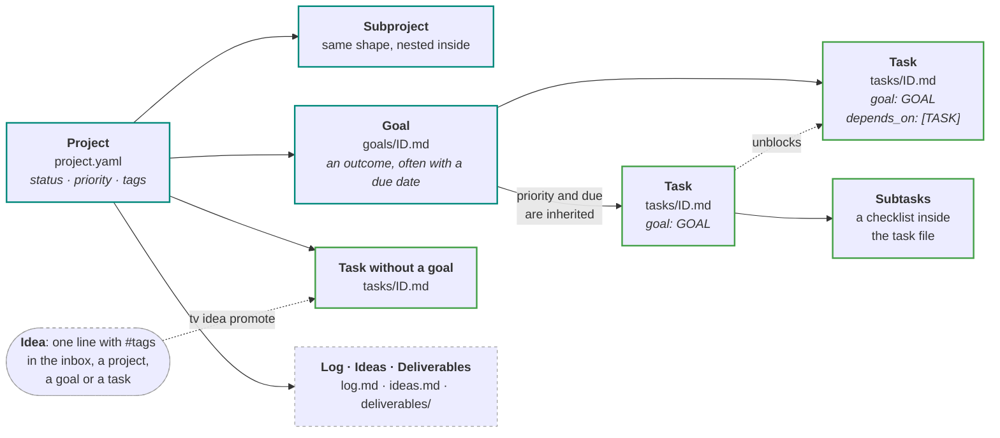

# tavla

[](https://github.com/Johanmkr/tavla/actions/workflows/ci.yml)
[](https://johanmkr.github.io/tavla/)
[](https://github.com/Johanmkr/tavla/releases)
[](pyproject.toml)
[](LICENSE)
[](https://github.com/astral-sh/ruff)
[](https://github.com/astral-sh/uv)

A research operations tool for one researcher juggling several projects:
goals, tasks, loose ideas and progress logs, and one question answered across
all of them: *what should I work on next?* CLI-first, plain text, git-native.

- **Plain text.** Everything is Markdown or YAML you can read, grep and edit by hand.
- **Git is the history.** Every change tavla makes is committed to your content
  repo, so `git log` is the audit trail and `tavla undo` reverts the last change.
- **Your data is separate.** Your content lives in its own private git repo,
  never in this software repo, and nothing is ever sent anywhere.


## How it fits together



A task that waits for others is left out of `next` until they're done, and
`tv flow` draws how it all depends on each other. See
[Organising work](https://johanmkr.github.io/tavla/guide/organising-work/)
for the details.

## Install

You need [uv](https://docs.astral.sh/uv/getting-started/installation/) and
`git`; uv fetches a suitable Python by itself. Then:

```sh
uv tool install git+https://github.com/Johanmkr/tavla@v0.3.0   # puts `tavla` and `tv` on your PATH
tv --install-completion                                        # optional: tab-completion
```

`tavla update` moves you to the newest release later, and
`uv tool uninstall tavla` removes it (your content stays where it is).
Linux and macOS are tested; Windows isn't yet.

## Try it without your own data

```sh
tv demo                                    # a playground repo with example projects
export TAVLA_CONTENT_DIR=~/.cache/tavla/demo
tv next                                    # what to work on, across all projects
tv flow thesis                             # how the thesis work depends on itself
tv task done run-baseline                  # write commands work too; tv undo reverts
unset TAVLA_CONTENT_DIR                    # back to your own content
```

## A first session

```sh
tv init                                    # creates ~/.local/share/tavla, a git repo
tv project add "Master thesis" --priority high --id thesis
tv goal add "Experiments" -p thesis --due 01.12.26 --id exp
tv task add "Set up the pipeline" -g exp --id pipeline
tv task add "Run the baseline" -g exp --after pipeline   # waits for pipeline
tv next                                    # only "pipeline" can start
tv task done pipeline                      # -> Now unblocked: run-the-baseline
tv capture "try mixed precision #speed"    # a quick thought, into the inbox
tv status                                  # stale projects, what's waiting, what's due
```

`tv` is short for `tavla`. Ids can be abbreviated to any unique prefix or
piece of the title, and `tv COMMAND -h` shows every option with examples.
[Getting started](https://johanmkr.github.io/tavla/getting-started/) walks
through this properly.

## Status

tavla is in **alpha**: it's used every day, but commands may still change
between releases. Your content is plain files in git, and every change to the
file layout comes with a `tavla migrate` step, so upgrading never strands it.

**Works today:** projects and subprojects, goals, tasks with subtasks and
dependencies, ideas and the inbox, progress logs, deliverables, `next`,
`status`, the `flow` board, `undo`, `check`, `demo` and `--json` output.
**Next:** an interactive terminal UI. **Later:** links to code repos and a
reading library synced with Zotero.

## Learn more

The [user guide](https://johanmkr.github.io/tavla/) has everything else:

- [Getting started](https://johanmkr.github.io/tavla/getting-started/) and two worked
  examples ([a master's thesis](https://johanmkr.github.io/tavla/examples/master-thesis/),
  [several projects](https://johanmkr.github.io/tavla/examples/several-projects/))
- the [daily workflow](https://johanmkr.github.io/tavla/guide/daily-workflow/):
  `next`, `status`, `flow`, `log`
- the [command reference](https://johanmkr.github.io/tavla/reference/cli/) and
  [file formats](https://johanmkr.github.io/tavla/reference/file-formats/)
- [notes for alpha testers](https://johanmkr.github.io/tavla/alpha/) and the
  [FAQ](https://johanmkr.github.io/tavla/faq/)

Found a bug or have an idea? [Open an issue](https://github.com/Johanmkr/tavla/issues/new/choose).
To work on tavla itself, see [CONTRIBUTING.md](CONTRIBUTING.md). MIT licensed.
